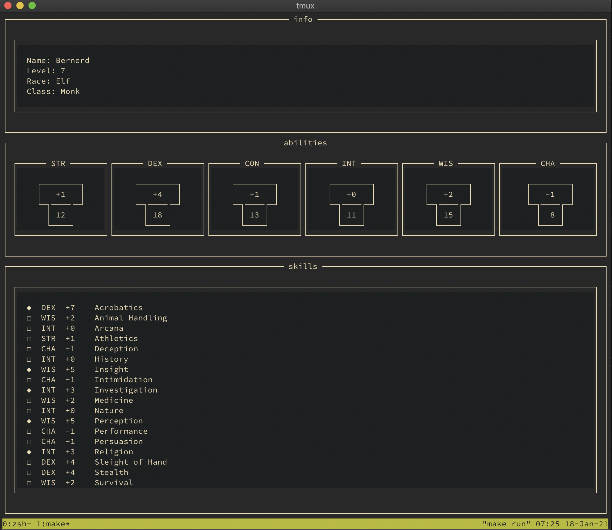

# zeke-sheet

[](https://goreportcard.com/report/github.com/ecshreve/zeke-sheet)
[](https://golang.org/doc/go1.14)

## Description

(work in progress)

The end goal of this project is to make a terminal based interactive Dungeons and Dragons character sheet.

## Installation

- make sure you have `go` installed, `version 1.14` or newer should work

- clone the repo

```{bash}
git clone https://github.com/ecshreve/zeke-sheet.git
```

- build and run the project

```{bash}
cd zeke-sheet
make run
```

## Screenshot


